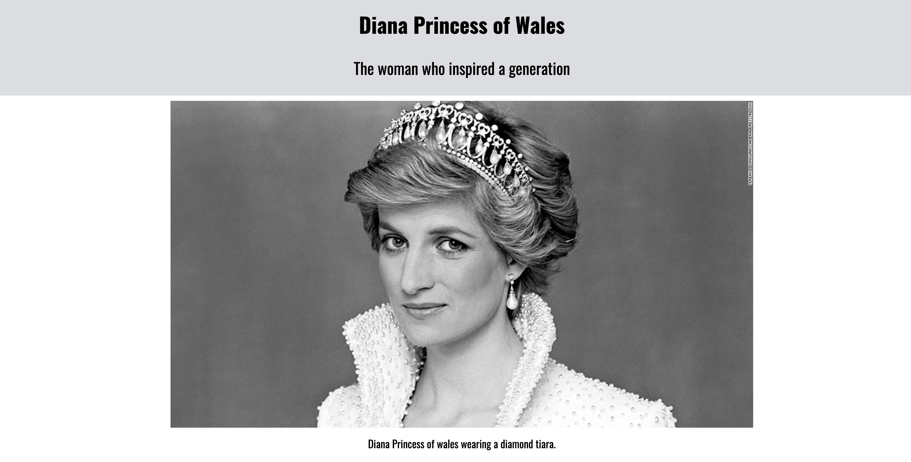

# Tribute Page

- This project was to create a tribut page.
- The purpose of this project was to learn the learn basic html and css.
- I built a tribute page for Diana Princess of Wales.

## Live project

- [View the live project here.](https://brianwhelandublin.github.io/tribute/)

## Screenshots

  - 

### Languages Used.

- [HTML5](https://en.wikipedia.org/wiki/HTML5)

  - HTML5 was used to create the content and base of each page.

- [CSS3](https://en.wikipedia.org/wiki/CSS)

  - CSS3 was used to then style the page and make it responsive through media queries, and interactive through using CSS transitions.